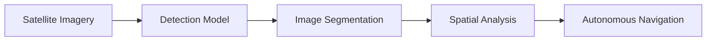

<p align="center">
  
</p>

<p align="center">
  
</p>

---

# <p align="center">Neural OS • v2.0</p>

<div align="center">

```text
BOOTING PRABAL_AI_SYSTEM...

[■■■■■■■■■■■■■■■■■■■■] 100%

✓ Agentic Core Initialized
✓ Multi-Agent Engine Loaded
✓ RAG Memory Connected
✓ LLM Orchestration Online
✓ Autonomous Workflow Engine Active

SYSTEM STATUS: OPERATIONAL
```

</div>

---

##  System Overview

<table>
<tr>
<td width="50%">

### 👋 About Me

I'm **Prabal Batra**, an **AI Systems Engineer** focused on building intelligent systems that can:

→ **reason**  
→ **retrieve**  
→ **plan**  
→ **execute**

Currently building **production-grade AI workflows** involving:

- Agentic AI
- Multi-Agent Systems
- Retrieval-Augmented Generation
- LLM Orchestration
- Intelligent Automation

</td>

<td width="50%">

### ⚡ Current Mission

```yaml
status: building
focus:
  - Agentic AI
  - Multi-Agent Systems
  - LLM Infrastructure
  - Autonomous Workflows

location: India 🇮🇳
role: AI Systems Engineer
mission: Solve real-world problems with AI
```

</td>
</tr>
</table>

---

# 🧠 Live System Status

<p align="center">

| System | Status |
|--------|--------|
| Agentic AI Core | 🟢 ONLINE |
| Multi-Agent Engine | 🟢 ACTIVE |
| RAG Memory | 🟢 CONNECTED |
| LLM Pipeline | 🟢 RUNNING |
| AI Research Engine | 🟡 TRAINING |
| Autonomous Workflows | 🟢 DEPLOYED |

</p>

---

# 🚀 Featured Systems

<table>
<tr>

<td width="50%">

## 🧠 Agentic Intelligence Platform

Production-grade AI system designed using **Agentic / Structured RAG**.

### Capabilities

✔ Intent Parsing  
✔ Task Decomposition  
✔ Context Optimization  
✔ Intelligent Query Planning  
✔ Autonomous Execution  

### Performance Metrics

```text
100+ Queries/day
92% Context Reduction
60% Faster Responses
40% Accuracy Improvement
```

**Stack**

`Python`
`FastAPI`
`LLMs`
`RAG`
`Docker`
`PostgreSQL`

</td>

<td width="50%">

## 🤖 Multi-Agent Research Engine

Graph-based autonomous reasoning system using **LangChain + LangGraph**.

### Agent Network

✔ Research Agent  
✔ Retrieval Agent  
✔ Planning Agent  
✔ Analysis Agent  
✔ Summarization Agent  

### Workflow

```text
Input
 ↓
Planning Agent
 ↓
Retriever
 ↓
Reasoning Graph
 ↓
Execution
 ↓
Final Response
```

**Stack**

`LangChain`
`LangGraph`
`FAISS`
`ChromaDB`

</td>

</tr>
</table>

---

## 🌕 Vision Intelligence System



AI-powered **computer vision system** for **lunar crater detection and autonomous navigation**.

---

# ⚙️ Technology Stack

### AI / LLM Systems

<p align="center">

</p>

<p align="center">


</p>

---

# 🏆 Achievements

<table>
<tr>
<td width="50%">

🏅 Academic Excellence Award

🏆 5+ National & State Hackathon Wins

📜 2 Patent Applications Published

📖 Published Technical Book Chapter

</td>

<td width="50%">

🚀 Built enterprise AI systems

🧠 Presented Agentic AI to leadership

⚡ Contributed to AI-powered project bids

🤖 Building production AI systems

</td>
</tr>
</table>

---

# 📈 Neural Activity

<p align="center">


</p>

<p align="center">

</p>

---

# 🌐 Connect

<p align="center">

<a href="https://www.linkedin.com/in/prabal-batra-69ab69260/">

</a>

<a href="mailto:batraprabal04@gmail.com">

</a>

<a href="https://github.com/PrabalBatra">

</a>

</p>

---

<p align="center">
  
### *Building intelligent systems that reason, retrieve, and execute.*

</p>

<p align="center">

</p>
